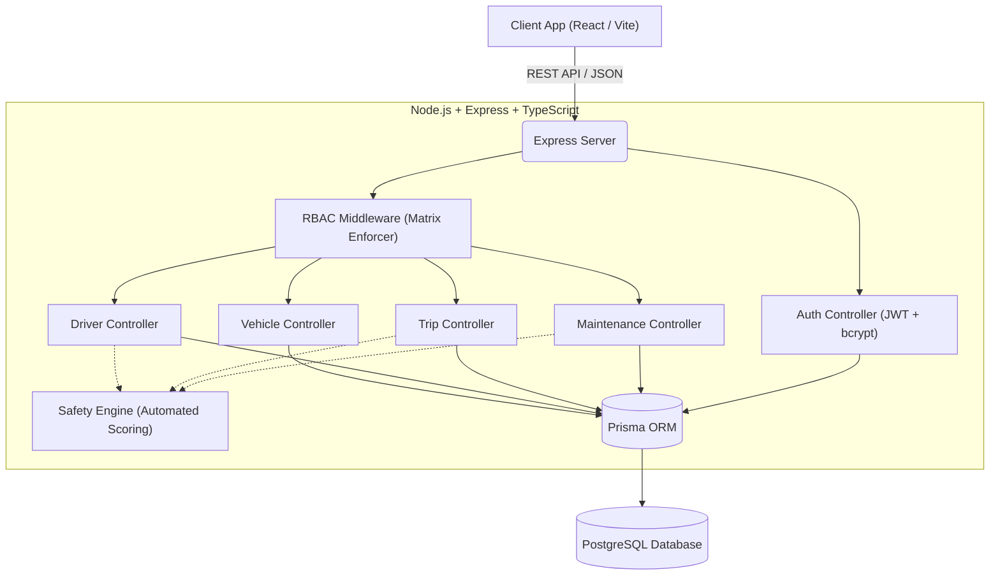

# 🚚 TransitOps: Smart Transport Operations Platform

TransitOps is an end-to-end transport operations platform designed to digitize vehicle, driver, dispatch, maintenance, and expense management. It enforces strict business rules, automates driver safety scoring, and provides deep operational insights through a granular Role-Based Access Control (RBAC) matrix.

## 🚀 Key Features

*   **Granular Role-Based Access Control (RBAC):** Matrix-driven access control ensuring users only see and interact with modules they are authorized for.
*   **Automated Safety Scoring:** An intelligent engine that tracks driver safety. It automatically deducts points for accidents or speeding and auto-suspends drivers who drop below a safety threshold.
*   **Centralized Fleet & Driver Management:** Complete lifecycle management from registration to retirement/suspension.
*   **Trip Dispatching & Tracking:** Seamlessly link vehicles, drivers, and trips.

## 🏗️ Architecture

TransitOps is built as a modern, decoupled monolithic repository.



## 🔐 Role-Based Access Control (RBAC) Matrix

Access is strictly governed by the following matrix. The system supports three access levels: **Full (✓)**, **View-Only (view)**, and **No Access (—)**.

| Role | Fleet | Drivers | Trips | Fuel/Exp. | Analytics |
| :--- | :---: | :---: | :---: | :---: | :---: |
| **Fleet Manager** | ✓ | ✓ | — | — | ✓ |
| **Dispatcher** | view | — | ✓ | — | — |
| **Safety Officer** | — | ✓ | view | — | — |
| **Financial Analyst** | view | — | — | ✓ | ✓ |

> *Note: This matrix is enforced dynamically at the middleware level via the `requirePermission` guard.*

## 🛡️ Automated Safety Score Engine

The Safety Engine is a core business rule enforcement mechanism. 
*   **Starting Score:** All drivers start with a score of 100.
*   **Penalties:** The engine automatically deducts points when negative events are logged (e.g., a trip completed at an impossible average speed, or a vehicle returns with an `ACCIDENT_DAMAGE` maintenance log).
*   **Rewards:** Safe, incident-free trips slowly restore points.
*   **Auto-Suspension:** If a driver's score drops below **60**, the system automatically triggers a `SUSPENDED` status, blocking them from being dispatched on any future trips until a Safety Officer intervenes.

## 💻 Technology Stack

**Backend:**
*   **Runtime:** Node.js
*   **Framework:** Express.js
*   **Language:** TypeScript
*   **ORM:** Prisma
*   **Database:** PostgreSQL
*   **Validation:** Zod

**Frontend:**
*   **Framework:** React (Vite)
*   *(Additional frontend stack details managed by client team)*

**Shared:**
*   Zod schemas are shared across the client and server to ensure end-to-end type safety and validation consistency.

## 🛠️ Getting Started

### Prerequisites
*   [Docker](https://www.docker.com/products/docker-desktop/) and Docker Compose

### Installation & Running

We use Docker to orchestrate the entire platform, making setup completely seamless.

1.  **Clone the repository:**
    ```bash
    git clone https://github.com/Bhumii23/odoo.git
    cd transitops
    ```

2.  **Environment Setup:**
    Ensure you have your `.env` files configured if required by the docker setup (usually Docker Compose handles the defaults).

3.  **Start the Platform:**
    ```bash
    docker-compose up -d --build
    ```
    *This single command will spin up the PostgreSQL database, run the Prisma migrations, start the Node.js/Express backend, and launch the React frontend.*

4.  **Access the Application:**
    *   **Frontend:** `http://localhost:5173` (or whatever port Vite is mapped to)
    *   **Backend API:** `http://localhost:3000`


